# H-Style RBD Nodes：Blender ジオメトリノード向けのリジッドボディ破壊ノード

**ドキュメント** ([English](README.md), [日本語](README_JA.md), [中文](README_ZH.md))

*H-Style RBD Nodes* は、Blender のジオメトリノード (Geometry Nodes) で使うリジッドボディ破壊ノード集です。ノードの命名、入出力、パラメータのグループ分けは H-Style に従っています。  
モデルを `RBD Material Fracture` に接続すると、破片、コンストレイント、衝突判定用プロキシの 3 系統のデータが得られます。これらを `RBD Bullet Solver` まで接続し、動きをタイムラインにベイクしてからゲームエンジンへエクスポートします。破壊、爆発、地割れなど、ゲームエフェクトで使うモデルのアニメーションを対象としています。

**主な特徴**

* **H-Style のノード**：1 つの機能を 1 つのノードが担当し、属性を使ってノード間でデータを渡します。途中に独自のノードを挿入できます
* **タイムラインへのベイク**：Blender 内蔵の Bullet でシミュレーションし、結果をノードに保存します。その後はタイムラインをスクラブしても再計算されません
* **ゲームエンジン向けのエクスポート**：ボーンアニメーション付き FBX、リジッドボディ用 VAT、Alembic に対応し、Unity (URP) 用のシェーダーと再生コンポーネントを同梱します

Concrete / Glass / Wood の 3 種類の破砕パターン、既存パーツを破片として使う機能、接触関係に基づくコンストレイントの生成、クラスタリング、初速度、遅延アクティベーション、Blender のフォースフィールド、同じリジッドボディワールドでの複数オブジェクトのシミュレーションに対応しています。  
本拡張機能は Python コードのみで構成され、Blender 本体を変更せず、バイナリも含みません。ノードグループは初回使用時に生成されます。

| 壁への衝突 | 地割れ | 爆発 |
|---|---|---|
| 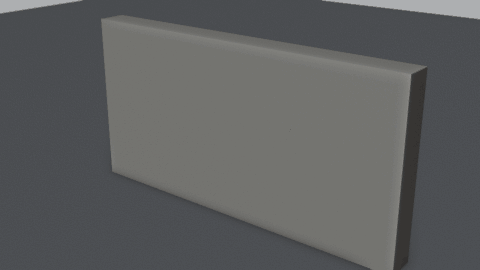 | 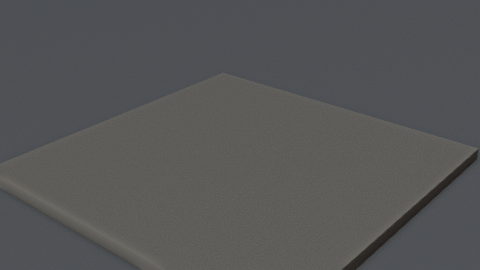 | 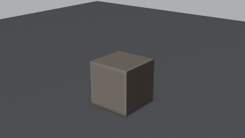 |

| ガラス | 木の柱 | レンガの壁（既存パーツ） |
|---|---|---|
| 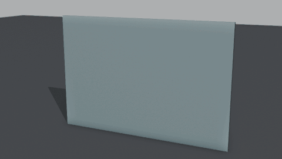 | 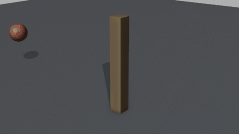 | 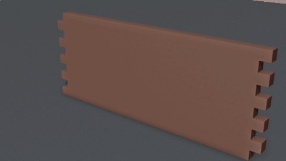 |

各ノードの詳細は以下を参照してください。

> **このプロジェクトは AI が扱いやすいように作られています。** 私はあなたのために引き継ぎ用ドキュメント [AGENTS.md](AGENTS.md)（英語）を用意しました。あなたが使っている AI に読ませれば、この拡張機能を説明したり、自分で変更したりできます。

## 目次

詳細

- [設定](#設定)
    - [動作環境](#動作環境)
    - [インストール](#インストール)
- [使い方](#使い方)
    - [RBD ネットワークの作成](#rbd-ネットワークの作成)
    - [パラメータの調整](#パラメータの調整)
    - [ノードの追加](#ノードの追加)
    - [ベイク](#ベイク)
- [ノード](#ノード)
    - [3 系統のジオメトリデータ](#3-系統のジオメトリデータ)
    - [RBD Material Fracture](#rbd-material-fracture)
    - [RBD Assemble](#rbd-assemble)
    - [RBD Constraints From Rules](#rbd-constraints-from-rules)
    - [RBD Configure](#rbd-configure)
    - [RBD Select](#rbd-select)
    - [RBD Constraint Properties](#rbd-constraint-properties)
    - [RBD Cluster](#rbd-cluster)
    - [RBD Exploded View](#rbd-exploded-view)
    - [RBD Bullet Solver](#rbd-bullet-solver)
- [属性](#属性)
- [初速度とフォースフィールド](#初速度とフォースフィールド)
- [複数オブジェクトの同時シミュレーション](#複数オブジェクトの同時シミュレーション)
- [エクスポート](#エクスポート)
    - [Unity での使用](#unity-での使用)
    - [VAT フォーマット](#vat-フォーマット)
- [サンプル](#サンプル)
- [制限事項](#制限事項)
- [商標](#商標)
- [ライセンス](#ライセンス)

## 設定

#### 動作環境
本拡張機能は以下の環境に対応しています。

* Blender 5.2 LTS 以降

VAT エクスポートに同梱するシェーダーと再生コンポーネントは、以下の環境で動作を確認しています。

* Unity 6 (6000.0 LTS)
* Universal Render Pipeline 17

#### インストール
以下の 2 つの方法から、どちらかを選んでインストールしてください。

**方法 1：Blender にドラッグ＆ドロップ**

以下のリンクをブラウザーから Blender のウィンドウにドラッグし、画面の案内に従って確認してください。

**[➜ このリンクを Blender にドラッグしてインストール](https://raw.githubusercontent.com/excifroge/H-Style-RBD-Nodes/main/Repository/h_style_rbd_nodes.zip?repository=.%2Findex.json&blender_version_min=5.2.0)**

* 先に **Edit > Preferences > System > Network** で **Allow Online Access** を有効にしてください
* 初めてリンクをドラッグすると、この拡張機能のリポジトリを追加するかどうかを Blender が確認します。承認するとインストールが始まります。以後、新しいバージョンが公開されたら、**Edit > Preferences > Get Extensions** から更新できます
* このリンクはドラッグ用です。クリックした場合は zip のダウンロードのみが行われます

**方法 2：zip からインストール**

1. [Releases](https://github.com/excifroge/H-Style-RBD-Nodes/releases) ページから `h_style_rbd_nodes-x.y.z.zip` をダウンロードします。解凍しないでください
2. Blender で **Edit > Preferences > Get Extensions** を開き、右上のドロップダウンメニューから **Install from Disk** を選んで、ダウンロードした zip を指定します。ダウンロードした zip ファイルを Blender のウィンドウに直接ドラッグすることもできます

どちらの方法でも、インストール後に 3D ビューポートで `N` を押してサイドバーを開き、**H-Style RBD** タブが表示されることを確認してください。

インストール後、ジオメトリノードエディターの **Add** メニューに **RBD** サブメニューが追加されます。

本ドキュメントのスクリーンショットとパラメータ名は、英語のインターフェイスに基づいています。  
ノード名はどの言語でも英語のままです。本拡張機能に含まれるインターフェイスの翻訳は簡体字中国語のみです。日本語など、それ以外の言語に設定した Blender では、ノードの入力名は英語で表示されます。ただし Geometry や Density など、Blender 自体が翻訳している一般的な語は、その言語で表示されます。各表の「説明」欄の冒頭にある日本語名は、理解を助けるための訳語であり、実際の表示名とは限りません。

## 使い方

#### RBD ネットワークの作成
閉じたメッシュオブジェクトを選択し、サイドバーの **H-Style RBD** タブで **Fracture This Object**（このオブジェクトを破砕）をクリックします。

オブジェクトにジオメトリノードモディファイアーが追加され、`RBD Material Fracture` と `RBD Bullet Solver` が接続された状態になります。

  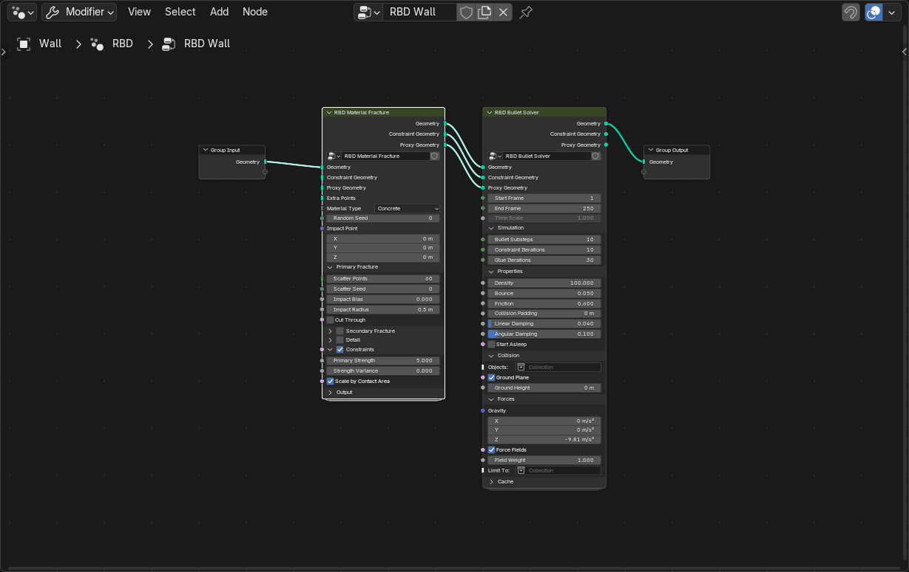 
  作成直後の RBD ネットワーク

モデルがすでにレンガや板などの個別パーツで構成されている場合は、**Use Its Loose Parts**（既存の独立パーツを使用）をクリックします。  
この場合は、`RBD Assemble`、`RBD Constraints From Rules`、`RBD Bullet Solver` の 3 つのノードが作成されます。

#### パラメータの調整
RBD ノードのパラメータは、ノード上でもサイドバーでも設定できます。どちらも同じデータを編集します。

  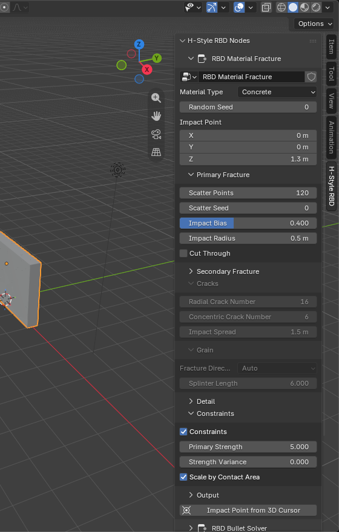 
  サイドバーに表示されたノードのパラメータ

位置を指定するパラメータ（Impact Point、Origin、Wave Origin、Center）の下には、**Impact Point from 3D Cursor**（3D カーソルから衝撃位置を取得）などのボタンがあります。3D カーソルの位置をオブジェクトのローカル空間に変換して入力できます。

#### ノードの追加
ジオメトリノードエディターで **Add > RBD** を選び、既存ノード間のリンク上にノードをドロップします。  
RBD ノード間では [3 系統のジオメトリデータ](#3-系統のジオメトリデータ)を接続する必要があります。

#### ベイク
サイドバー下部の **Bake**（ベイク）をクリックします。

Bullet はジオメトリノードの評価中には実行できないため、`RBD Bullet Solver` ノード自体はシミュレーションを行いません。  
ベイク後はシミュレーション結果がノードに保存され、ノードはベイク済みの動きを出力します。上流ノードのパラメータを変更しても表示は変わらないため、更新するには **Re-Bake**（再ベイク）をクリックしてください。ゴミ箱アイコンの **Free Bake**（ベイクを削除）をクリックすると、リアルタイムの破砕結果に戻ります。

ベイク後は、以下の操作ができます。

* タイムラインをスクラブ：シミュレーションは再計算されず、上流の破砕ノードも評価されません
* オブジェクトを移動、回転、拡縮、複製：破壊アニメーション全体が追従します
* [エクスポート](#エクスポート)

ベイクに失敗してもデータは変更されず、以前のベイク結果を引き続き使用できます。

## ノード
RBD ノードは全部で 9 個あります。以下ではデータの流れる順に説明します。

#### 3 系統のジオメトリデータ
H-Style に従い、各ノード間で 3 系統のジオメトリデータを渡します。

<table width="100%">
<thead>
<tr><td><b>ソケット</b></td><td><b>説明</b></td></tr>
</thead>
<tbody>
<tr><td><b>Geometry</b></td><td>
ジオメトリ。破片そのもの、つまりレンダリングに使うメッシュです。
</td></tr>
<tr><td><b>Constraint Geometry</b></td><td>
コンストレイント用ジオメトリ。辺のみで構成されたメッシュです。1 本の辺が 1 つの接着コンストレイントを表し、両端は接続先の 2 つの破片の中心にあります。
</td></tr>
<tr><td><b>Proxy Geometry</b></td><td>
プロキシジオメトリ。衝突判定に使う形状です。シミュレーション時には、この系統にある各破片のポイントから作った凸包を衝突形状として使います。 
より単純な衝突形状を使いたい場合は、この系統を変更してください。
</td></tr>
</tbody>
</table>

#### RBD Material Fracture
モデルを破片に分割し、コンストレイント用ジオメトリとプロキシジオメトリを生成します。H-Style の同名ノードに対応します。

  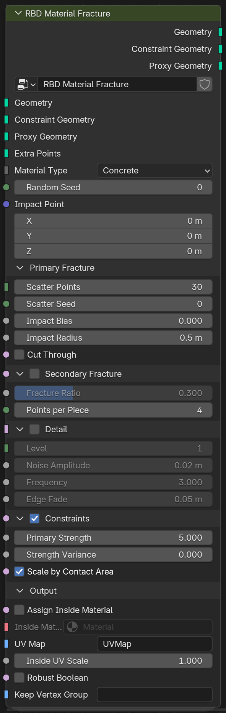
  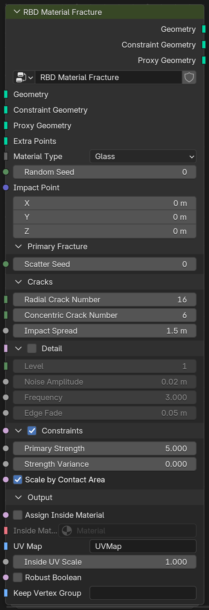
  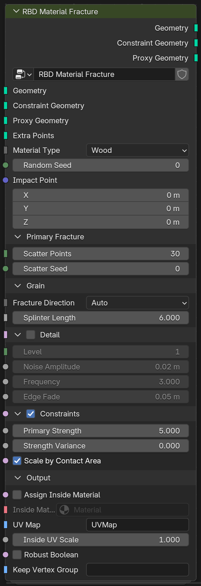 
  Material Type が Concrete、Glass、Wood の場合の RBD Material Fracture

現在の Material Type で使わないパラメータは、ノード上で自動的に非表示になります。

<table width="100%">
<thead>
<tr><td colspan="3"><b>入力</b></td><td><b>説明</b></td></tr>
</thead>
<tbody>
<tr><td colspan="3"><b>Geometry</b></td><td>
ジオメトリ。破砕するモデルです。閉じたメッシュである必要があります。詳細は<a href="#制限事項">制限事項</a>を参照してください。
</td></tr>
<tr><td colspan="3"><b>Constraint Geometry</b> / <b>Proxy Geometry</b></td><td>
コンストレイント用ジオメトリ、プロキシジオメトリ。上流からのコンストレイントとプロキシを、このノードで生成したものと結合して出力します。接続しなくても構いません。
</td></tr>
<tr><td colspan="3"><b>Extra Points</b></td><td>
追加ポイント。

任意。ポイントクラウドまたはメッシュを接続します。

<ul>
<li>Concrete、Wood: これらのポイントをセルのシード点として使用し、自動散布は行いません</li>
<li>Glass: 最初のポイントを衝撃位置として使用します</li>
</ul>

</td></tr>
<tr><td colspan="3"><b>Material Type</b></td><td>
マテリアルタイプ。

以下の選択肢から破砕パターンを指定します。

<ul>
<li>Concrete（コンクリート）: 塊状の破片。衝撃位置の周囲では細かく砕けます（デフォルト）</li>
<li>Glass（ガラス）: 衝撃位置を中心とした放射状・同心円状の亀裂。薄い板をまっすぐ貫通するように切断します</li>
<li>Wood（木材）: 木目に沿った細長い木片</li>
</ul>

</td></tr>
<tr><td colspan="3"><b>Random Seed</b></td><td>
ランダムシード。ノード全体のランダムシードです。
</td></tr>
<tr><td colspan="3"><b>Impact Point</b></td><td>
衝撃位置。オブジェクトに衝撃を与える位置を、オブジェクト空間で指定します。 
Glass の亀裂はここから始まり、Concrete はこの周囲で細かく砕けます。
</td></tr>
<tr><td colspan="3"><b>Primary Fracture</b></td><td>
一次破砕。パラメータグループです。
</td></tr>
<tr><td></td><td colspan="2"><b>Scatter Points</b></td><td>
散布ポイント数。

<b>Material Type が Concrete または Wood の場合のみ表示されます。</b>

シード点の数です。おおむね 1 点につき 1 つの破片ができます。デフォルト値は 30 です。

</td></tr>
<tr><td></td><td colspan="2"><b>Scatter Seed</b></td><td>
散布シード。ポイント散布のランダムシードのみを変更します。
</td></tr>
<tr><td></td><td colspan="2"><b>Impact Bias</b></td><td>
衝撃位置への集中度。

<b>Material Type が Concrete の場合のみ表示されます。</b>

衝撃位置の周囲に集中させるシード点の割合です。値を大きくすると、衝撃位置の近くが細かく砕けます。

</td></tr>
<tr><td></td><td colspan="2"><b>Impact Radius</b></td><td>
衝撃半径。

<b>Material Type が Concrete の場合のみ表示されます。</b>

上記のシード点を集中させる範囲です。

</td></tr>
<tr><td></td><td colspan="2"><b>Cut Through</b></td><td>
貫通切断。

<b>Material Type が Concrete の場合のみ表示されます。</b>

モデルの最も薄い軸方向に、毎回まっすぐ貫通するように切断します。地面、薄い板、正面から見る壁に使います。

</td></tr>
<tr><td colspan="3"><b>Secondary Fracture</b></td><td>
二次破砕。

<b>Material Type が Concrete の場合のみ表示されます。</b>

有効化スイッチ付きのパラメータグループです。一部の破片をさらに分割し、大きな破片と小さな破片を混在させます。

</td></tr>
<tr><td></td><td colspan="2"><b>Fracture Ratio</b></td><td>
再破砕の割合。再び分割する破片の割合です。
</td></tr>
<tr><td></td><td colspan="2"><b>Points per Piece</b></td><td>
破片ごとの散布ポイント数。再び分割する各破片に追加するシード点の数です。 
最終的な破片数は、おおむね Scatter Points ×（1 + Fracture Ratio × Points per Piece）です。
</td></tr>
<tr><td colspan="3"><b>Cracks</b></td><td>
亀裂。

<b>Material Type が Glass の場合のみ表示されます。</b>

パラメータグループです。

</td></tr>
<tr><td></td><td colspan="2"><b>Radial Crack Number</b></td><td>
放射状の亀裂数。衝撃位置から外側に伸びる亀裂の数です。
</td></tr>
<tr><td></td><td colspan="2"><b>Concentric Crack Number</b></td><td>
同心円状の亀裂数。衝撃位置を囲む亀裂の輪の数です。
</td></tr>
<tr><td></td><td colspan="2"><b>Impact Spread</b></td><td>
衝撃範囲。同心円状の亀裂が衝撃位置からどこまで広がるかを指定します。
</td></tr>
<tr><td colspan="3"><b>Grain</b></td><td>
木目。

<b>Material Type が Wood の場合のみ表示されます。</b>

パラメータグループです。

</td></tr>
<tr><td></td><td colspan="2"><b>Fracture Direction</b></td><td>
破砕方向。

木目の方向です。

<ul>
<li>Auto（自動）: モデルの最も長い軸方向（デフォルト）</li>
<li>X / Y / Z: 指定した軸</li>
</ul>

</td></tr>
<tr><td></td><td colspan="2"><b>Splinter Length</b></td><td>
木片の長さ。細長い木片の長さが幅の何倍になるかを指定します。
</td></tr>
<tr><td colspan="3"><b>Detail</b></td><td>
ディテール。有効化スイッチ付きのパラメータグループです。切断面に凹凸を加えます。
</td></tr>
<tr><td></td><td colspan="2"><b>Detail Level</b></td><td>
細分化レベル。切断面を細分化する回数です。1 レベル上げるごとに切断面のポリゴン数は 4 倍になります。ゲームエンジン向けには 1 を推奨します。
</td></tr>
<tr><td></td><td colspan="2"><b>Noise Amplitude</b> / <b>Frequency</b></td><td>
ノイズの振幅、周波数。凹凸の高さと細かさです。
</td></tr>
<tr><td></td><td colspan="2"><b>Edge Fade</b></td><td>
エッジの減衰。モデルの元の表面からこの距離の範囲で凹凸を徐々になくし、外側の表面を閉じた状態に保ちます。
</td></tr>
<tr><td colspan="3"><b>Constraints</b></td><td>
コンストレイント。有効化スイッチ付きのパラメータグループです。有効にすると、切断面を共有する隣接破片間にコンストレイントを生成します。
</td></tr>
<tr><td></td><td colspan="2"><b>Primary Strength</b></td><td>
一次破砕の接着強度。接着コンストレイントの破断しきい値です。衝撃がこのしきい値を超えると接着が切れます。
</td></tr>
<tr><td></td><td colspan="2"><b>Strength Variance</b></td><td>
強度のばらつき。強度のランダムな変化量です。
</td></tr>
<tr><td></td><td colspan="2"><b>Scale by Contact Area</b></td><td>
接触面積に応じたスケーリング。有効にすると、共有する切断面が小さい破片間の接着が弱くなります。
</td></tr>
<tr><td colspan="3"><b>Output</b></td><td>
出力。パラメータグループです。
</td></tr>
<tr><td></td><td colspan="2"><b>Assign Inside Material</b> / <b>Inside Material</b></td><td>
内部面へのマテリアル割り当て、内部面のマテリアル。切断面にマテリアルを指定します。
</td></tr>
<tr><td></td><td colspan="2"><b>UV Map</b> / <b>Inside UV Scale</b></td><td>
UV マップ、内部面の UV スケール。切断面にボックス投影の UV を作成し、指定した UV マップに書き込みます。
</td></tr>
<tr><td></td><td colspan="2"><b>Robust Boolean</b></td><td>
堅牢なブーリアン。常に低速な厳密ブーリアンソルバーを使用します。無効の場合は、高速なソルバーが失敗した破片のみ、自動的に厳密ソルバーへ切り替えます。
</td></tr>
<tr><td></td><td colspan="2"><b>Keep Vertex Group</b></td><td>
頂点グループの保持。

モデル上の頂点グループ（または float 型の属性）の名前です。破片には同じ名前で保持され、下流での破片選択に使えます。

頂点グループ自体はブーリアン演算で保持できないため、破片の各頂点は、元のモデルの表面上で最も近い位置のウェイトを取得します。

</td></tr>
</tbody>
</table>

モデルの元の UV、マテリアル、頂点カラーは保持されます。  
破片の外側の表面は、元のモデルのシェーディング法線を引き継ぎます。そのため、破砕後でもまだ動いていない状態では、元のモデルと同じ外観になり、破片間の継ぎ目は見えません。

<table width="100%">
<thead>
<tr><td><b>出力</b></td><td><b>説明</b></td></tr>
</thead>
<tbody>
<tr><td><b>Geometry</b></td><td>ジオメトリ。破片です。属性 <code>piece_id</code>、<code>inside</code>、<code>rbd_pivot</code>、<code>rbd_rest</code> を書き込みます。</td></tr>
<tr><td><b>Constraint Geometry</b></td><td>コンストレイント用ジオメトリ。コンストレイントです。属性 <code>strength</code>、<code>area</code>、<code>anchor</code> を書き込みます。</td></tr>
<tr><td><b>Proxy Geometry</b></td><td>プロキシジオメトリ。切断面の凹凸を含まない破片です。</td></tr>
</tbody>
</table>

#### RBD Assemble
切断は行わず、モデル内の各独立パーツ（連結したメッシュ領域）を 1 つの破片として扱います。H-Style の Assemble に対応します。

レンガの壁、板、手作業で分割した破片など、すでにパーツに分かれているモデルに使います。先にすべてのパーツを 1 つのオブジェクトに結合してください（`Ctrl+J`）。

  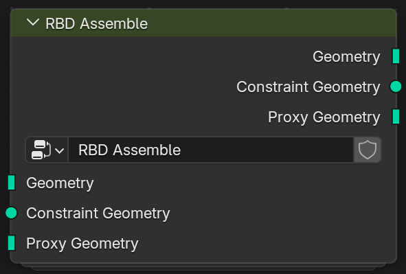 
  RBD Assemble

このノードにパラメータはありません。パーツの元の UV、マテリアル、頂点グループはそのまま保持されます。

<table width="100%">
<thead>
<tr><td><b>出力</b></td><td><b>説明</b></td></tr>
</thead>
<tbody>
<tr><td><b>Geometry</b></td><td>ジオメトリ。破片です。属性 <code>piece_id</code>、<code>inside</code>、<code>rbd_pivot</code>、<code>rbd_rest</code> を書き込みます。</td></tr>
<tr><td><b>Constraint Geometry</b></td><td>コンストレイント用ジオメトリ。上流のコンストレイントをそのまま出力します。このノードはコンストレイントを生成しないため、後ろに <a href="#rbd-constraints-from-rules">RBD Constraints From Rules</a> を接続してください。</td></tr>
<tr><td><b>Proxy Geometry</b></td><td>プロキシジオメトリ。破片そのものです。</td></tr>
</tbody>
</table>

#### RBD Constraints From Rules
表面が互いに近い破片の間にコンストレイントを生成します。H-Style の同名ノードに対応します。

任意の方法で作った破片に使えます。`RBD Material Fracture` の後に接続する場合は、コンストレイントが二重に生成されないよう、そちらの **Constraints** を無効にしてください。

  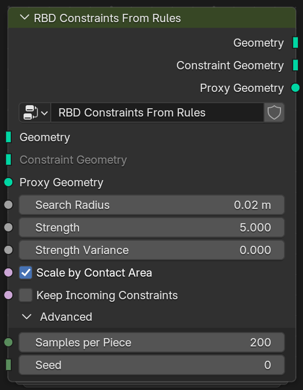 
  RBD Constraints From Rules

<table width="100%">
<thead>
<tr><td colspan="3"><b>入力</b></td><td><b>説明</b></td></tr>
</thead>
<tbody>
<tr><td colspan="3"><b>Search Radius</b></td><td>
検索半径。表面同士の距離がこの値より小さい破片を接着します。デフォルト値は 2 センチメートルです。 
面同士が接しているパーツは、そのまま検出できます。レンガの目地など、パーツ間に隙間がある場合は、その幅より少し大きい値を指定してください。
</td></tr>
<tr><td colspan="3"><b>Strength</b> / <b>Strength Variance</b> / <b>Scale by Contact Area</b></td><td>
強度、強度のばらつき、接触面積に応じたスケーリング。<a href="#rbd-material-fracture">RBD Material Fracture</a> のコンストレイント設定と同じです。
</td></tr>
<tr><td colspan="3"><b>Keep Incoming Constraints</b></td><td>
入力コンストレイントの保持。有効の場合は上流の既存コンストレイントに追加し、無効の場合は置き換えます（デフォルト）。
</td></tr>
<tr><td colspan="3"><b>Advanced</b></td><td>
詳細設定。パラメータグループです。
</td></tr>
<tr><td></td><td colspan="2"><b>Samples per Piece</b></td><td>
破片ごとのサンプル数。隣接破片を探すために、各破片の表面に散布するポイントの数です。値を大きくすると、より小さい接触面も検出できます。
</td></tr>
<tr><td></td><td colspan="2"><b>Seed</b></td><td>
ランダムシード。ポイント散布と強度のばらつきに使うランダムシードです。
</td></tr>
</tbody>
</table>

#### RBD Configure
選択した破片に、シミュレーションへの参加、初速度、アクティベーション時刻、物理特性の属性を書き込みます。H-Style の同名ノードに対応します。

  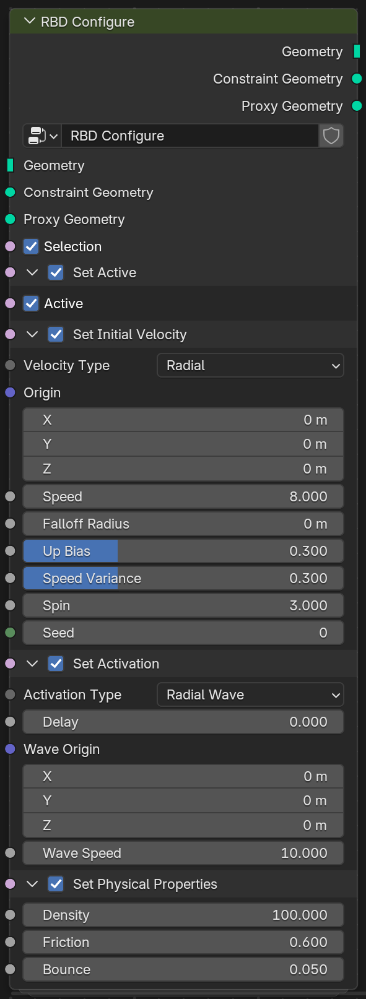 
  4 つのパラメータグループをすべて有効にした RBD Configure

4 つのパラメータグループには、それぞれ有効化スイッチがあります。有効なグループのみが属性を書き込み、選択されていない破片は元の値を保持します。  
複数の `RBD Configure` を直列につなぐと、破片ごとに異なる設定を適用できます。

<table width="100%">
<thead>
<tr><td colspan="3"><b>入力</b></td><td><b>説明</b></td></tr>
</thead>
<tbody>
<tr><td colspan="3"><b>Selection</b></td><td>
選択。設定対象の破片です。デフォルトではすべて選択されています。 
<a href="#rbd-select">RBD Select</a> または任意のブーリアンフィールドを接続できます。ある破片の頂点の大部分が選択されていると、その破片を選択したものとして扱います。
</td></tr>
<tr><td colspan="3"><b>Set Active</b></td><td>
シミュレーションへの参加設定。有効化スイッチ付きのパラメータグループです。属性 <code>active</code> を書き込みます。
</td></tr>
<tr><td></td><td colspan="2"><b>Active</b></td><td>
シミュレーションへの参加。無効にすると、選択した破片は常に静止しますが、ほかの破片との衝突は行います。壁の下部や地面の外周を固定する場合に使います。
</td></tr>
<tr><td colspan="3"><b>Set Initial Velocity</b></td><td>
初速度の設定。有効化スイッチ付きのパラメータグループです。属性 <code>v</code> と <code>w</code> を書き込みます。詳細は<a href="#初速度とフォースフィールド">初速度とフォースフィールド</a>を参照してください。
</td></tr>
<tr><td></td><td colspan="2"><b>Velocity Type</b></td><td>
速度タイプ。

<ul>
<li>Constant（一定）: すべての破片に同じ速度を設定します</li>
<li>Radial（放射状）: 爆発のように、原点から外側へ向かう速度を設定します（デフォルト）</li>
</ul>

</td></tr>
<tr><td></td><td colspan="2"><b>Velocity</b></td><td>
速度。

<b>Velocity Type が Constant の場合のみ表示されます。</b>

速度をメートル/秒で指定します。方向はオブジェクト空間で指定します。

</td></tr>
<tr><td></td><td colspan="2"><b>Origin</b></td><td>
原点。

<b>以下の項目は Velocity Type が Radial の場合のみ表示されます。</b>

爆発の中心をオブジェクト空間で指定します。

</td></tr>
<tr><td></td><td colspan="2"><b>Speed</b></td><td>
速さ。原点での速度の大きさをメートル/秒で指定します。
</td></tr>
<tr><td></td><td colspan="2"><b>Falloff Radius</b></td><td>
減衰半径。この距離で速度が 0 になります。0 にすると減衰しません。
</td></tr>
<tr><td></td><td colspan="2"><b>Up Bias</b></td><td>
上方向への偏り。速度方向を上向きにする度合いです。0 は原点から真っすぐ外側へ、1 は真上へ向かいます。
</td></tr>
<tr><td></td><td colspan="2"><b>Speed Variance</b></td><td>
速さのばらつき。速度の大きさのランダムな変化量です。
</td></tr>
<tr><td></td><td colspan="2"><b>Spin</b></td><td>
回転。ランダムな回転速度をラジアン/秒で指定します。
</td></tr>
<tr><td></td><td colspan="2"><b>Seed</b></td><td>
ランダムシード。速さのばらつきと回転に使うランダムシードです。
</td></tr>
<tr><td colspan="3"><b>Set Activation</b></td><td>
アクティベーション時刻の設定。有効化スイッチ付きのパラメータグループです。属性 <code>activate_time</code> を書き込みます。 
破片はアクティベーションまで静止し、その後ソルバーに制御を渡します。
</td></tr>
<tr><td></td><td colspan="2"><b>Activation Type</b></td><td>
アクティベーション方式。

<ul>
<li>At Time（指定時刻）: すべての破片を同じ時刻にアクティベートします</li>
<li>Radial Wave（放射状の波）: 波の原点からの距離に応じて、順にアクティベートします（デフォルト）</li>
</ul>

</td></tr>
<tr><td></td><td colspan="2"><b>Delay</b></td><td>
遅延。開始フレームからの秒数です。
</td></tr>
<tr><td></td><td colspan="2"><b>Wave Origin</b> / <b>Wave Speed</b></td><td>
波の原点、波の速度。

<b>Activation Type が Radial Wave の場合のみ表示されます。</b>

波の中心（オブジェクト空間）と伝播速度（メートル/秒）です。

</td></tr>
<tr><td colspan="3"><b>Set Physical Properties</b></td><td>
物理特性の設定。有効化スイッチ付きのパラメータグループです。属性 <code>density</code>、<code>friction</code>、<code>bounce</code> を書き込みます。
</td></tr>
<tr><td></td><td colspan="2"><b>Density</b> / <b>Friction</b> / <b>Bounce</b></td><td>
密度、摩擦、反発。設定されていない破片には <a href="#rbd-bullet-solver">RBD Bullet Solver</a> の値を使います。
</td></tr>
</tbody>
</table>

#### RBD Select
選択を表すブーリアンフィールドを出力し、`RBD Configure` または `RBD Constraint Properties` の **Selection** に接続します。H-Style でバウンディングボックスや属性に基づいて作成するグループに相当します。

  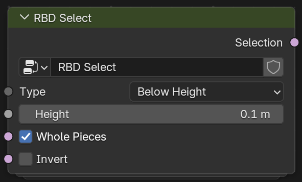
  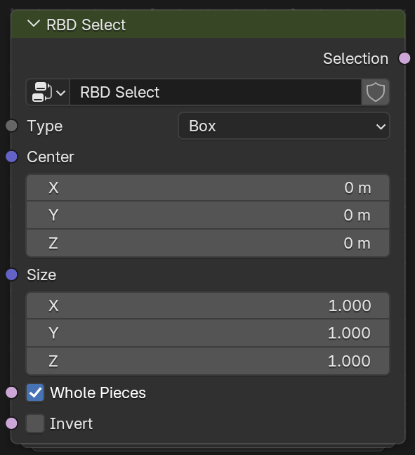
  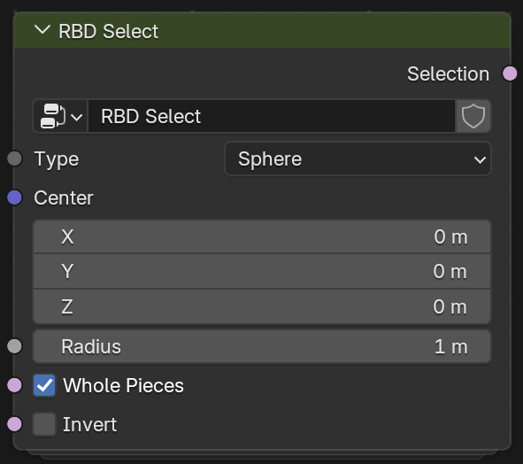
  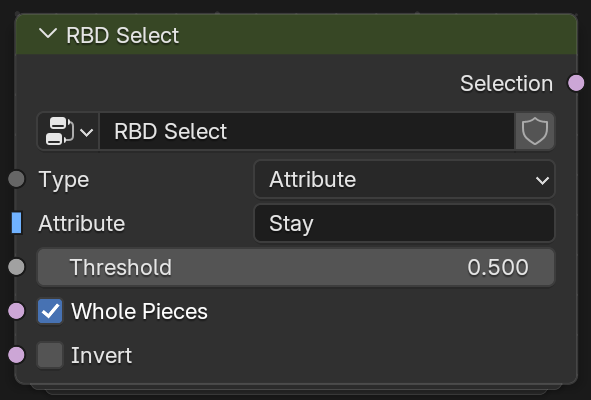 
  Type が Below Height、Box、Sphere、Attribute の場合の RBD Select

複数の選択は、Blender 標準のブーリアン演算ノードで組み合わせられます。

<table width="100%">
<thead>
<tr><td colspan="3"><b>入力</b></td><td><b>説明</b></td></tr>
</thead>
<tbody>
<tr><td colspan="3"><b>Type</b></td><td>
タイプ。

以下の選択肢から選択方法を指定します。位置はすべてオブジェクト空間で指定します。

<ul>
<li>Below Height（指定高さ以下）: 最下点が指定した高さ以下にある破片（デフォルト）</li>
<li>Box（ボックス）: 中心がボックス内にある破片</li>
<li>Sphere（球）: 中心が球内にある破片</li>
<li>Attribute（属性）: 頂点グループのウェイトまたは属性の平均値が、しきい値以上の破片</li>
</ul>

</td></tr>
<tr><td></td><td colspan="2"><b>Height</b></td><td>
高さ。<b>Type が Below Height の場合のみ表示されます。</b>
</td></tr>
<tr><td></td><td colspan="2"><b>Center</b> / <b>Size</b></td><td>
中心、サイズ。<b>Type が Box の場合のみ表示されます。</b>Type が Sphere の場合は <b>Center</b> と <b>Radius</b>（半径）が表示されます。
</td></tr>
<tr><td></td><td colspan="2"><b>Attribute</b> / <b>Threshold</b></td><td>
属性、しきい値。

<b>Type が Attribute の場合のみ表示されます。</b>

頂点グループまたは属性の名前です。破砕後の破片に使う場合は、<code>RBD Material Fracture</code> の <b>Keep Vertex Group</b> で指定した名前を入力してください。

</td></tr>
<tr><td colspan="3"><b>Whole Pieces</b></td><td>
破片単位。有効の場合は破片全体で判定します（デフォルト）。無効の場合は頂点ごとに判定します。
</td></tr>
<tr><td colspan="3"><b>Invert</b></td><td>
反転。選択を反転します。
</td></tr>
</tbody>
</table>

#### RBD Constraint Properties
選択したコンストレイントの強度を変更します。H-Style の同名ノードに対応します。

  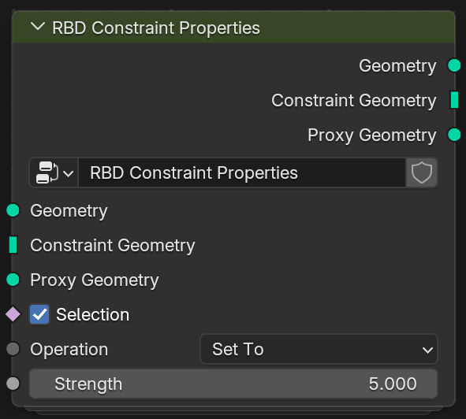 
  RBD Constraint Properties

<table width="100%">
<thead>
<tr><td colspan="3"><b>入力</b></td><td><b>説明</b></td></tr>
</thead>
<tbody>
<tr><td colspan="3"><b>Selection</b></td><td>
選択。変更対象のコンストレイントを、コンストレイント用ジオメトリの辺で評価します。デフォルトではすべて選択されています。
</td></tr>
<tr><td colspan="3"><b>Operation</b></td><td>
演算。

<ul>
<li>Set To（値を設定）: 強度を指定した値に設定します（デフォルト）</li>
<li>Multiply By（乗算）: 現在の強度に指定した値を掛けます</li>
</ul>

</td></tr>
<tr><td colspan="3"><b>Strength</b></td><td>
強度。上記の演算に使う値です。
</td></tr>
</tbody>
</table>

#### RBD Cluster
破片を複数のクラスタに分け、クラスタ内の接着を強くします。破壊時に大きな塊と小さな破片が混在する効果を作れます。H-Style の同名ノードに対応します。

  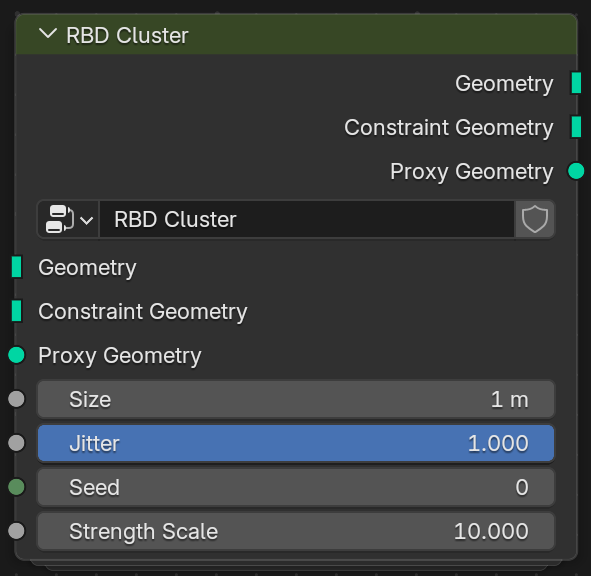 
  RBD Cluster

<table width="100%">
<thead>
<tr><td colspan="3"><b>入力</b></td><td><b>説明</b></td></tr>
</thead>
<tbody>
<tr><td colspan="3"><b>Size</b></td><td>
サイズ。クラスタのおおよその大きさです。
</td></tr>
<tr><td colspan="3"><b>Jitter</b> / <b>Seed</b></td><td>
ジッター、ランダムシード。クラスタ形状の不規則さとランダムシードです。
</td></tr>
<tr><td colspan="3"><b>Strength Scale</b></td><td>
強度倍率。クラスタ内のコンストレイントの強度にこの値を掛けます。デフォルト値は 10 です。
</td></tr>
</tbody>
</table>

破片に属性 <code>cluster</code> を書き込みます。

#### RBD Exploded View
破片を中心から外側へ押し広げ、破砕結果を確認するために使います。H-Style の Exploded View に対応します。

  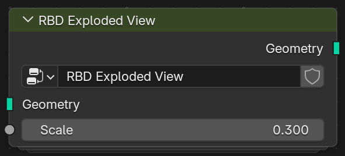 
  RBD Exploded View

このノードには **Geometry** のみを接続します。確認が終わったら削除するか、ミュートしてください（選択して `M`）。

<table width="100%">
<thead>
<tr><td colspan="3"><b>入力</b></td><td><b>説明</b></td></tr>
</thead>
<tbody>
<tr><td colspan="3"><b>Scale</b></td><td>
スケール。破片を押し広げる距離です。
</td></tr>
</tbody>
</table>

コンストレイントを表示するには、ノードエディターで任意の RBD ノードの **Constraint Geometry** 出力を `Ctrl+Shift+LMB` でクリックし、Viewer ノードに接続します。

#### RBD Bullet Solver
リジッドボディのシミュレーションを行います。H-Style の同名ノードに対応します。

シミュレーションはサイドバーの **Bake**（ベイク）ボタンで実行します。詳細は[ベイク](#ベイク)を参照してください。

  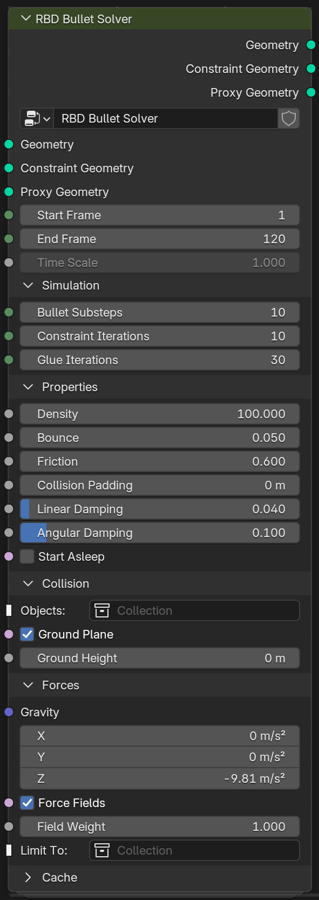 
  RBD Bullet Solver

このノードの設定はベイクボタンが読み取るため、ノード上で直接指定する必要があります。ほかのノードからのリンクで値を渡すことはできません（3 系統のジオメトリ入力は除きます）。

<table width="100%">
<thead>
<tr><td colspan="3"><b>入力</b></td><td><b>説明</b></td></tr>
</thead>
<tbody>
<tr><td colspan="3"><b>Start Frame</b> / <b>End Frame</b></td><td>
開始フレーム、終了フレーム。シミュレーションのフレーム範囲です。
</td></tr>
<tr><td colspan="3"><b>Time Scale</b></td><td>
時間スケール。ベイク結果の再生速度です。0.5 はスローモーションになります。
</td></tr>
<tr><td colspan="3"><b>Simulation</b></td><td>
シミュレーション。パラメータグループです。
</td></tr>
<tr><td></td><td colspan="2"><b>Bullet Substeps</b></td><td>
Bullet のサブステップ数。1 フレームあたりのシミュレーションステップ数です。破片が高速で動く場合や薄い場合は増やしてください。
</td></tr>
<tr><td></td><td colspan="2"><b>Constraint Iterations</b></td><td>
コンストレイントの反復回数。各ステップで衝突とコンストレイントを解く反復回数です。
</td></tr>
<tr><td></td><td colspan="2"><b>Glue Iterations</b></td><td>
接着の反復回数。各接着コンストレイントに使う反復回数です。値を大きくすると接着された破片が硬くなりますが、計算は遅くなります。0 にすると Constraint Iterations と同じ回数を使います。
</td></tr>
<tr><td colspan="3"><b>Properties</b></td><td>
物理特性。パラメータグループです。
</td></tr>
<tr><td></td><td colspan="2"><b>Density</b> / <b>Bounce</b> / <b>Friction</b></td><td>
密度、反発、摩擦。<a href="#rbd-configure">RBD Configure</a> で設定されていない破片には、ここの値を使います。密度の単位はキログラム/立方メートルです。
</td></tr>
<tr><td></td><td colspan="2"><b>Collision Padding</b></td><td>
衝突マージン。衝突形状の外側に設けるマージンです。
</td></tr>
<tr><td></td><td colspan="2"><b>Linear Damping</b> / <b>Angular Damping</b></td><td>
移動の減衰、回転の減衰。並進運動と回転運動を減衰させます。
</td></tr>
<tr><td></td><td colspan="2"><b>Start Asleep</b></td><td>
開始時のスリープ。有効にすると、破片は衝突を受けるまで静止します。
</td></tr>
<tr><td colspan="3"><b>Collision</b></td><td>
衝突。パラメータグループです。
</td></tr>
<tr><td></td><td colspan="2"><b>Collision Objects</b></td><td>
衝突オブジェクト。破片と衝突するオブジェクトを含むコレクションです。各オブジェクトは自身のアニメーションに従って動きます。
</td></tr>
<tr><td></td><td colspan="2"><b>Ground Plane</b> / <b>Ground Height</b></td><td>
地面、地面の高さ。地面を有効にし、ワールド空間での高さを指定します。
</td></tr>
<tr><td colspan="3"><b>Forces</b></td><td>
外力。パラメータグループです。
</td></tr>
<tr><td></td><td colspan="2"><b>Gravity</b></td><td>
重力。重力加速度です。
</td></tr>
<tr><td></td><td colspan="2"><b>Force Fields</b></td><td>
フォースフィールド。有効にすると、シーン内の Blender のフォースフィールドが破片に作用します（デフォルト）。詳細は<a href="#初速度とフォースフィールド">初速度とフォースフィールド</a>を参照してください。
</td></tr>
<tr><td></td><td colspan="2"><b>Field Weight</b></td><td>
フォースフィールドのウェイト。すべてのフォースフィールドの強度にこの値を掛けます。重力には影響しません。
</td></tr>
<tr><td></td><td colspan="2"><b>Limit To</b></td><td>
対象コレクション。指定すると、このコレクション内のフォースフィールドのみが作用します。空欄の場合はシーン内のすべてのフォースフィールドを使います。
</td></tr>
<tr><td colspan="3"><b>Cache</b></td><td>
キャッシュ。デフォルトで折りたたまれているパラメータグループです。ベイクボタンによって値が設定されるため、通常は手動で変更する必要はありません。
</td></tr>
<tr><td></td><td colspan="2"><b>Frame Offset</b></td><td>
フレームオフセット。ベイクした動きのタイミングをフレーム単位でずらします。
</td></tr>
</tbody>
</table>

## 属性
RBD ノードは、以下の属性を使ってデータを渡します。途中に独自のノードを挿入して属性を読み書きすることで、RBD ノード自体にはない制御を追加できます。

破片上の属性はポイントドメインにあり、シミュレーション時には破片ごとに平均値を使います。

<table width="100%">
<thead>
<tr><td><b>属性</b></td><td><b>型</b></td><td><b>書き込むノード</b></td><td><b>説明</b></td></tr>
</thead>
<tbody>
<tr><td colspan="4"><b>Geometry</b></td></tr>
<tr><td><code>piece_id</code></td><td>整数 / ポイント</td><td>Material Fracture、Assemble</td><td>頂点が属する破片。H-Style の <code>name</code> に相当します</td></tr>
<tr><td><code>inside</code></td><td>ブーリアン / 面</td><td>Material Fracture、Assemble</td><td>切断で生成された内部面かどうか。H-Style の <code>inside</code> グループに相当します</td></tr>
<tr><td><code>rbd_pivot</code></td><td>ベクトル / ポイント</td><td>Material Fracture、Assemble</td><td>破片の中心</td></tr>
<tr><td><code>rbd_rest</code></td><td>ベクトル / ポイント</td><td>Material Fracture、Assemble</td><td>切断面に凹凸を加える前の位置</td></tr>
<tr><td><code>active</code></td><td>ブーリアン / ポイント</td><td>Configure</td><td>偽の場合はシミュレーションで動かず、障害物としてのみ作用します</td></tr>
<tr><td><code>v</code>、<code>w</code></td><td>ベクトル / ポイント</td><td>Configure</td><td>ソルバーに制御を渡す時点の速度と角速度</td></tr>
<tr><td><code>activate_time</code></td><td>浮動小数点 / ポイント</td><td>Configure</td><td>開始フレームからソルバーに制御を渡すまでの秒数</td></tr>
<tr><td><code>density</code>、<code>friction</code>、<code>bounce</code></td><td>浮動小数点 / ポイント</td><td>Configure</td><td>負の値は未設定を意味し、ソルバーノードの値を使います</td></tr>
<tr><td><code>cluster</code></td><td>整数 / ポイント</td><td>Cluster</td><td>クラスタの ID</td></tr>
<tr><td colspan="4"><b>Constraint Geometry</b></td></tr>
<tr><td><code>piece_id</code></td><td>整数 / ポイント</td><td>Material Fracture、Constraints From Rules</td><td>辺のこの端に接続されている破片</td></tr>
<tr><td><code>strength</code></td><td>浮動小数点 / 辺</td><td>Material Fracture、Constraints From Rules、Constraint Properties、Cluster</td><td>接着コンストレイントの破断しきい値</td></tr>
<tr><td><code>area</code></td><td>浮動小数点 / 辺</td><td>Material Fracture、Constraints From Rules</td><td>接触面積</td></tr>
<tr><td><code>anchor</code></td><td>ベクトル / 辺</td><td>Material Fracture、Constraints From Rules</td><td>2 つの破片が接触する位置</td></tr>
</tbody>
</table>

## 初速度とフォースフィールド
破片を動かす方法は 2 つあり、単独でも組み合わせても使えます。

<table width="100%">
<thead>
<tr><td></td><td><b>初速度</b></td><td><b>フォースフィールド</b></td></tr>
</thead>
<tbody>
<tr><td><b>設定箇所</b></td><td><code>RBD Configure</code> の <b>Set Initial Velocity</b></td><td>シーンに Blender のフォースフィールドオブジェクトを追加し（<code>Shift+A</code> > Force Field）、<code>RBD Bullet Solver</code> の <b>Force Fields</b> を有効にします</td></tr>
<tr><td><b>作用の仕方</b></td><td>ソルバーに制御を渡す瞬間に、一度だけ速度を設定します</td><td>シミュレーション全体を通して継続的に作用します</td></tr>
<tr><td><b>用途</b></td><td>爆発や衝撃など、瞬間的な効果</td><td>風、乱流、渦、抗力など、継続的な効果</td></tr>
</tbody>
</table>

  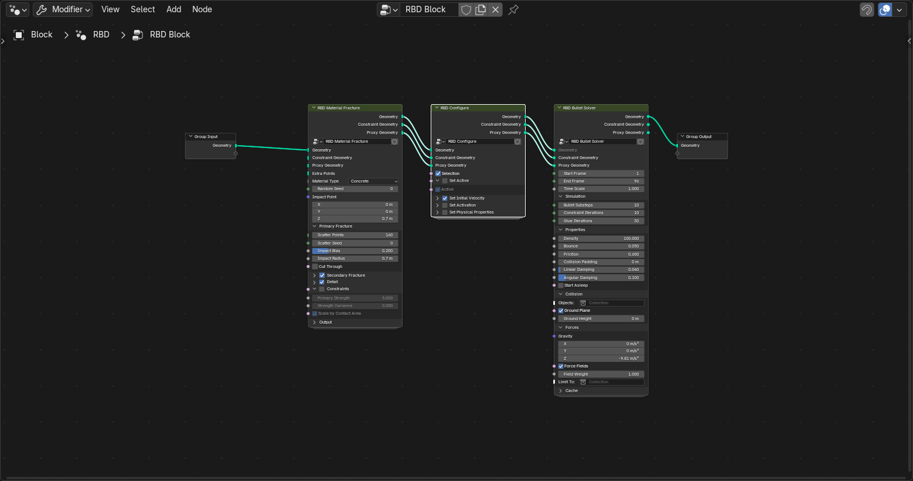 
  初速度とフォースフィールドを併用するネットワーク（サンプル 07）

フォースフィールドの作用は、Blender 標準のリジッドボディと同じです。

* フォースフィールドオブジェクトにはアニメーションを設定できます
* 強度が `S` のフォースフィールドは、各破片に `S ÷ フレームレート` ニュートンの力を加えます。したがって、`加速度 = 強度 × Field Weight ÷ (フレームレート × 破片の質量)` です
* 例えば、3 キログラムの破片に 24 フレーム/秒で 10 メートル/秒² の加速度を与えるには、約 720 の強度が必要です
* 軽い破片ほど速く加速します
* 力は破片の重心に作用し、それ自体では破片を回転させません
* まだアクティベートされていない破片や、**Active** が無効の破片は、フォースフィールドの影響を受けません
* **Start Asleep** が有効な破片は、フォースフィールドが作用するとすぐにスリープから復帰します
* 初速度を設定した破片には、フォースフィールドが 1 フレーム遅れて作用し始めます

## 複数オブジェクトの同時シミュレーション
各オブジェクトは、それぞれ独自の RBD ネットワークを持ちます。

`RBD Bullet Solver` を持つオブジェクトを複数選択すると、ベイクボタンが **Bake N Objects Together**（N 個のオブジェクトを同時にベイク）になります。  
これらのオブジェクトは同じリジッドボディワールドでシミュレーションされ、互いの破片が衝突します。結果は各オブジェクトのノードに保存され、エクスポートも個別に行います。

* 属性に書き込んだ情報（初速度、シミュレーションへの参加、アクティベーション時刻、コンストレイント）は、各オブジェクトで独立しています
* `RBD Bullet Solver` の設定には、アクティブオブジェクトのノード上の値を使います
* 異なるオブジェクトに属する破片の間には、コンストレイントはありません
* すべてのベイクが成功するか、すべてのデータが変更されずに残ります

## エクスポート
ベイク後は、サイドバー下部の 3 つのエクスポートボタンを使えます。

<table width="100%">
<thead>
<tr><td><b>ボタン</b></td><td><b>エクスポート内容</b></td><td><b>用途</b></td></tr>
</thead>
<tbody>
<tr><td><b>Export FBX (Bones)</b></td><td>ボーン FBX のエクスポート。破片ごとに 1 本のボーンを持つスキニングされたメッシュと、ベイク済みアニメーション</td><td>Unity や Unreal で通常のボーンアニメーションとして使用</td></tr>
<tr><td><b>Export VAT</b></td><td>VAT のエクスポート。メッシュ <code>.fbx</code>、位置と回転のテクスチャ <code>.exr</code>、<code>.json</code>、Unity 用のシェーダーとスクリプト</td><td>多数のインスタンス、GPU での再生</td></tr>
<tr><td><b>Export Alembic</b></td><td>Alembic のエクスポート。フレームごとのアニメーションメッシュ <code>.abc</code></td><td>ほかの DCC、オフラインレンダリング</td></tr>
</tbody>
</table>

FBX と VAT は、**Time Scale** や **Frame Offset** の影響を受けない元のベイク結果をエクスポートします。Alembic は、ビューポートに表示されている結果をエクスポートします。

FBX と VAT のエクスポート設定は以下のとおりです。

<table width="100%">
<thead>
<tr><td colspan="3"><b>オプション</b></td><td><b>説明</b></td></tr>
</thead>
<tbody>
<tr><td colspan="3"><b>Merge Unbroken Pieces</b></td><td>
分離しない破片の結合。有効の場合（デフォルト）、アニメーション全体を通して分離しない隣接破片を 1 つに結合します。常に静止している破片も 1 つに結合し、それらの間に隠れている切断面を削除します。 
ボーン数（または VAT テクスチャの列数）とポリゴン数が減り、見た目は変わりません。
</td></tr>
<tr><td></td><td colspan="2"><b>Merge Tolerance</b></td><td>
結合の許容誤差。結合後に破片上のどの点も、シミュレーション結果からこの距離を超えてずれない場合にのみ結合します。デフォルト値は 1 センチメートルです。
</td></tr>
<tr><td colspan="3"><b>Target</b></td><td>
出力先。

<b>VAT のみ。</b>

<ul>
<li>Unity: データを Unity の軸に変換します（デフォルト）</li>
<li>Blender Axes（Blender の軸）: データを Blender の軸のまま保持します</li>
</ul>

</td></tr>
<tr><td colspan="3"><b>Keep Rig in Scene</b></td><td>
リグをシーンに保持。<b>FBX のみ。</b>エクスポート後も、生成したアーマチュアとスキニングされたメッシュをシーンに残します。
</td></tr>
</tbody>
</table>

#### Unity での使用

**ボーンアニメーション付き FBX**  
ファイルをプロジェクトに追加し、モデルの Import Settings で **Animation > Anim. Compression** を **Off** に設定します。  
または、`.fbx` を選択し、メニュー **Assets > H-Style RBD Nodes > Fix Bone FBX Import** を実行してください。  
デフォルトの Keyframe Reduction では、高速で回転する破片に 1～2 センチメートルのずれが生じることがあります。

**VAT**  
エクスポートしたすべてのファイル（`HStyleRbdUnity` フォルダを含む）を、`Assets` 内の同じフォルダに配置します。エクスポートした `.json` を選択し、メニュー **Assets > H-Style RBD Nodes > Set Up VAT From Json** を実行してください。  
テクスチャのインポート設定、マテリアル、プレハブが自動的に作成されます。プレハブはそのままシーンに配置できます。

以下のファイルが、エクスポート時に `HStyleRbdUnity` フォルダに同梱されます。1 つの Unity プロジェクトには 1 セットだけ配置してください。

<table width="100%">
<thead>
<tr><td><b>ファイル</b></td><td><b>説明</b></td></tr>
</thead>
<tbody>
<tr><td><code>HStyleRbdVAT_URP.shader</code></td><td>そのまま使える URP シェーダー。シャドウパスと深度パスを含みます。ライティングはメインのディレクショナルライトと環境光のみを計算します</td></tr>
<tr><td><code>HStyleRbdVAT.hlsl</code></td><td>デコード関数。独自のシェーダーに組み込む際に呼び出します。使い方はファイル冒頭に記載されています</td></tr>
<tr><td><code>HStyleRbdVatSetup.cs</code></td><td>上記の設定メニュー（エディタースクリプト）</td></tr>
<tr><td><code>HStyleRbdVatPlayer.cs</code></td><td>再生コンポーネント（ランタイムスクリプト）</td></tr>
</tbody>
</table>

プレハブ上の再生コンポーネント `HStyleRbdVatPlayer` は、単発の再生を制御するために使います。

<table width="100%">
<thead>
<tr><td><b>プロパティ名</b></td><td><b>説明</b></td></tr>
</thead>
<tbody>
<tr><td><b>Play On Enable</b></td><td>オブジェクトが有効になると、自動的に最初から再生します</td></tr>
<tr><td><b>Loop</b> / <b>Hold At End</b></td><td>ループ再生の設定と、各ループの最終フレームで停止する秒数です</td></tr>
<tr><td><b>Speed</b></td><td>再生速度です</td></tr>
<tr><td><b>Break Particles</b></td><td>任意。Particle System を指定すると、各亀裂が開く瞬間に、その位置でパーティクルを放出します</td></tr>
<tr><td><b>Particles Per Metre</b> / <b>Max Particles Per Crack</b> / <b>Min Crack Size</b></td><td>亀裂が大きいほど放出数が増えます。亀裂ごとの上限を設定でき、最小サイズ未満の亀裂では放出しません</td></tr>
</tbody>
</table>

**Break Particles** に指定する Particle System では、Emission の放出レートを 0 にし、Play On Awake を無効にしてください。  
スクリプトから制御する場合は、`Play()`、`Seek(秒)` を使うか、`Stop()` の後に自分で `Advance(dt)` を呼び出します。

FBX と VAT のメッシュには、破片ごとのシェーダー表現に使える頂点カラーが含まれます。値はリニアで、精度は 8 ビットです。

<table width="100%">
<thead>
<tr><td><b>チャンネル</b></td><td><b>内容</b></td></tr>
</thead>
<tbody>
<tr><td>R</td><td>破片ごとのランダム値</td></tr>
<tr><td>G</td><td>破片が動き始める時刻。0 は最初のフレーム、1 は最後のフレームまたは常に静止している破片を表します</td></tr>
<tr><td>B</td><td>破片から衝撃位置までの距離。0 は最も近く、1 は最も遠い破片を表します</td></tr>
<tr><td>A</td><td>内部面は 1、元の表面は 0</td></tr>
</tbody>
</table>

VAT の `.json` には破断イベントも記録されます。各隣接破片ペアが分離する時刻と位置、亀裂の大きさ、開く速度です（`event_times`、`event_positions`、`event_sizes`、`event_speeds`）。  
再生コンポーネントは、このデータを使ってパーティクルを放出します。直接読み取って、VFX Graph、効果音、カメラシェイクに使うこともできます。

#### VAT フォーマット
本拡張機能は独自フォーマット `hrbd_vat_1` を使用しており、ほかのツールの VAT シェーダーとは互換性がありません。

* テクスチャの幅は（破片数 + 1）以上となる最小の 2 の累乗、高さは（フレーム数 + 1）以上となる最小の 2 の累乗です
* 行 `k` にベイクのフレーム `k` を格納し、`pivot_row` で指定した行に各破片の静止時のピボットを格納します
* 位置テクスチャの RGB は、そのフレームにおける破片のピボット位置です。回転テクスチャの RGBA は、静止姿勢に対する相対回転を表すクォータニオン xyzw です
* 座標はエクスポートしたメッシュのオブジェクト空間にあり、出力先エンジンの軸に変換されています（Unity：Blender の `(x, y, z)` を `(-x, z, -y)` に変換）
* メッシュの 2 番目の UV チャンネル (`TEXCOORD1`) の u は、`(破片 ID + 0.5) / テクスチャの幅` です
* デコード：`位置 = このフレームのピボット + 回転(頂点 - 静止時のピボット)`。法線と接線には回転のみを適用します
* RGBA Half テクスチャを使う場合、10 メートルの範囲での誤差は約 2～3 ミリメートルです

テクスチャを手動で設定する場合は、Import Settings で sRGB と Generate Mip Maps を無効にしてください。Filter Mode は Point、Wrap Mode は Clamp、Compression は None、Non-Power of 2 は None に設定します。

## サンプル
`Examples` フォルダには、ベイク済みのサンプルが 7 個あります。開いて破砕対象のオブジェクトを選択すると、ジオメトリノードエディターで RBD ネットワークを確認できます。

<table width="100%">
<thead>
<tr><td><b>ファイル</b></td><td><b>内容</b></td><td><b>ノード</b></td></tr>
</thead>
<tbody>
<tr><td><code>01_wall_smash</code></td><td>球が壁を突き破る</td><td>Material Fracture → Cluster → Configure（+ Select）→ Bullet Solver</td></tr>
<tr><td><code>02_ground_crack</code></td><td>地割れ</td><td>Material Fracture（Cut Through）→ Configure（Set Initial Velocity + Set Activation）→ Bullet Solver</td></tr>
<tr><td><code>03_explosion</code></td><td>爆発</td><td>Material Fracture → Configure（Set Initial Velocity）→ Bullet Solver</td></tr>
<tr><td><code>04_glass</code></td><td>衝撃で突き破られるガラス</td><td>Material Fracture（Glass）→ Configure（+ Select）→ Bullet Solver</td></tr>
<tr><td><code>05_wood_post</code></td><td>衝突で折れる木の柱</td><td>Material Fracture（Wood）→ Cluster → Configure（+ Select）→ Bullet Solver</td></tr>
<tr><td><code>06_brick_wall</code></td><td>既存のレンガで構成された壁</td><td>Assemble → Constraints From Rules → Configure（+ 2 つの Select）→ Bullet Solver</td></tr>
<tr><td><code>07_explosion_wind</code></td><td>風の中での爆発</td><td>Material Fracture → Configure（Set Initial Velocity）→ Bullet Solver、および風と乱流の 2 つのフォースフィールド</td></tr>
</tbody>
</table>

  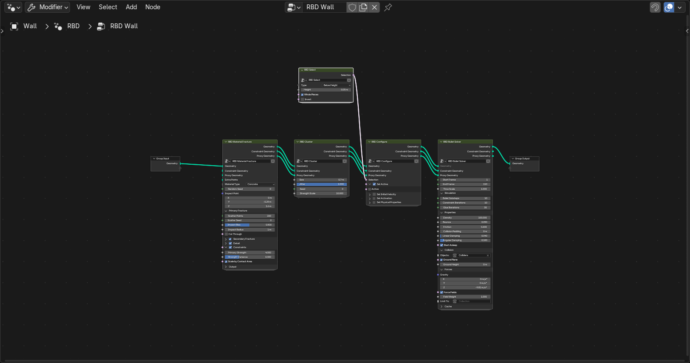 
  01_wall_smash の RBD ネットワーク

  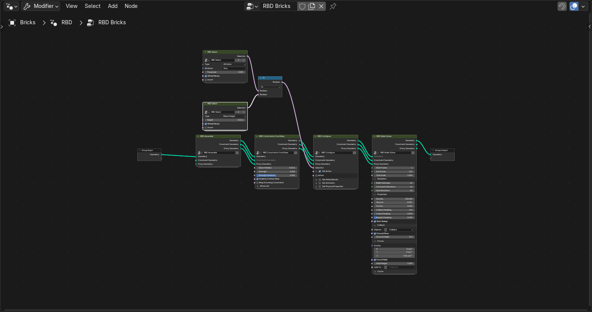 
  06_brick_wall の RBD ネットワーク。2 つの RBD Select をブーリアン演算ノードで組み合わせています

これらのサンプルは `Examples/make_examples.py` で生成しています。

## 制限事項
* Blender 5.2 でのみ動作を確認しています
* Unity 側は Unity 6000.0 と URP 17 でのみ動作を確認しています。Unreal では未確認です
* `RBD Bullet Solver` 自体はシミュレーションを行いません。上流のパラメータを変更した場合は、再ベイクが必要です
* 破砕するモデルは閉じたメッシュにしてください。穴、未結合の頂点、厚みのない面があると閉じていない破片が生成され、サイドバーに警告が表示されます
* 破片の衝突形状には凸包を使うため、凹んだ部分は埋められます
* 接着には弾性があり、衝撃を受けると、接着が切れていない箇所でも細い隙間が開いてから閉じることがあります。**Glue Iterations** を増やすと軽減できます
* 接着の破断は個別に判定されます。衝撃がコンストレイントのネットワークを伝播して減衰する処理はありません
* 時間とともに形状が変わる衝突オブジェクト（ボーンによるスキニング、シェイプキー）は、衝撃が過大になります
* ベイク済みのオブジェクトは、別のベイクの衝突オブジェクトとして安定して使用できません。代わりに[複数オブジェクトの同時シミュレーション](#複数オブジェクトの同時シミュレーション)を使ってください
* フォースフィールドの強度換算は Blender のリジッドボディと同じで、通常よりはるかに大きい値が必要です。実際にテストしたタイプは Wind と Force のみです
* 位置のパラメータはオブジェクト空間で指定します。地面の高さのみワールド空間です
* ガラスの亀裂は近似です。同心円状の亀裂は折れ線で表現され、主な亀裂から分岐する細かな亀裂はありません
* 二次破砕は近似です。角が欠ける表現（Chipping）や、シミュレーション中の再破砕には対応していません
* `RBD Constraints From Rules` の接触面積は推定値です。非常に小さい接触面は検出できない場合があります
* **Detail** を有効にすると、切断面と外側の表面の境界では頂点位置が一致しますが、頂点は結合されていません
* シミュレーション中は、各破片が 1 つの Blender オブジェクトになります。500 個程度は問題ありませんが、2000 個以上では明らかに遅くなります
* 破断イベントは VAT とともにのみエクスポートされます
* シーンの単位スケールが 1 以外でも考慮されず、Blender の 1 単位を常に 1 メートルとして扱います
* エクスポート時は同名のファイルを上書きします

実測結果、実装の詳細、テスト方法については、[AGENTS.md](AGENTS.md)（英語）を参照してください。

## 商標
Blender は Blender Foundation の商標です。Unity は Unity Technologies の商標です。

## ライセンス
本拡張機能は GPL-3.0-or-later ライセンスで公開されています。

VAT エクスポートに同梱する `HStyleRbdVAT.hlsl`、`HStyleRbdVAT_URP.shader`、`HStyleRbdVatSetup.cs`、`HStyleRbdVatPlayer.cs` は CC0-1.0 で公開しており、任意のプロジェクトにそのままコピーして使用できます。
